# ntu-sc1015
NTU SC1015 Data Science Project

## Data Preparation
### Dataset Introduction
The Yelp dataset is a subset of user-submitted data on the Yelp online review platform. It contains data about 150,346 businesses, 6,990,280 reviews spanning 11 metropolitan areas in the United States.

The Yelp dataset is composed of primarily JSON documents linked by identifiers (eg. `business_id`, `user_id` etc.)
organised in a dimensional data model of fact (`Review`, `Checkin`, `Tip`) &amp; dimension (`Business`, `User`) tables: [^1]

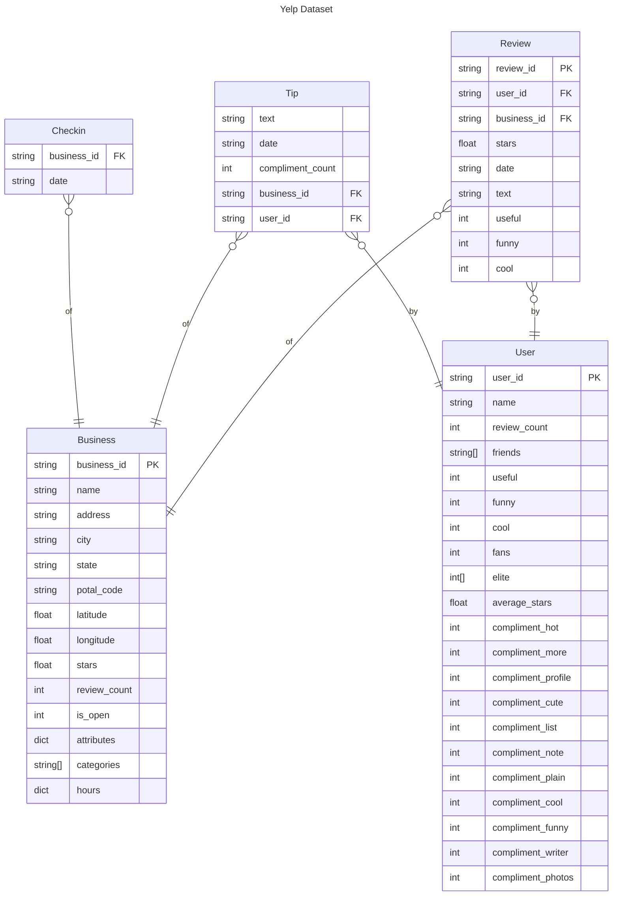

### Sampling & Denormalisation

```
80K     Dataset_User_Agreement.pdf
114M    yelp_academic_dataset_business.json
274M    yelp_academic_dataset_checkin.json
5.0G    yelp_academic_dataset_review.json
173M    yelp_academic_dataset_tip.json
3.2G    yelp_academic_dataset_user.json
```

In its original state, the Yelp dataset is not suitable for analysis as its relatively large. The full dataset cannot be loaded on a single machine. Sampling of the last 100 thousand reviews by review timestamp was performed with Apache Spark to reduce the data to a manageable size suitable for single node processing. Apache Spark scales data processing over multiple nodes and is therefore chosen to handle the large data volume.

Additionally, denationalisation of relationships is performed to form "one wide table" of data for ease of analysis. An outer join is performed on the reviews-business relationship to preserve businesses with no reviews. Due to duplicate nature of denormalised data, the Parquet file format was chosen to store the dataset sample due to ability to better handle duplicates with its run-level / dictionary encoding and snappy compression features [^2].


## Exploratory Data Analysis
### Questions to be Answered
1) Do Closed businesses have more negative reviews?
2) Do Open businesses have more reviews than Closed businesses?
3) What do people say about businesses that are Opened vs Closed?
4) Does the category of the business affect whether it will remain open or closed?
5) Is the stars rating for each category influenced based on the number of business?
6) Does opening business in different States matter?

### Text Analysis on Reviews Dataset
### Length of Reviews
The length of reviews was counted by number of words separated by spaces. The violin plot shows the distribution of the length of reviews in the dataset. We can see that the distribution is right skewed. \
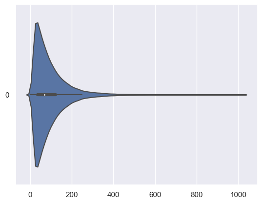

Looking at the descriptive statistics, we see that most of the data lie between 37 - 122 words, which implies that the reviews tend to be short.
```
25%         37.00000
50%         68.00000
75%        122.00000
```

### Sentiment Analysis
To analyse the sentiment of the reviews, we used a deep learning model from `flair` to tag each review as "positive", "negative" or "neutral". We chose `flair` as it was a state of the art model and it was trained over movie and product reviews.

However, the `flair` model returned a `sentiment_score` and `sentiment_value` formatted like below respectively: \
```0.993694 NEGATIVE ```
As it was not clearly documented in `flair`, we were unsure if the `sentiment_score` was telling us the model's confidence about the `sentiment_value`, or a numeric score for the `sentiment_value`. \
The descriptive statistics revealed:
```
        sentiment_score
count   99967.000000
mean	0.973884
std	    0.077059
min	    0.500150
25%	    0.993694
50%	    0.998567
75%	    0.999562
max	    1.000000
```
Because it ranged from 0 to 1, it was more likely that it was representing the model's confidence of the sentiment_value, hence it was not very useful and we dropped the column.


The crosstab below reveals the count of positive/negative reviews of Open vs Closed businesses:
```
sentiment_value   NEGATIVE  POSITIVE
business_is_open                    
0                      169       198
1                    34684     64916
```
From the crosstab, we can see that the data is very biased to open businesses, and there are not many reviews for closed businesses.

## Question 1 Verdict
Hence, to answer the first question, we cannot conclude that closed businesses have more negative reviews. This is because the total review count for closed businesses is much lower than Open businesses, which made the negative/positive review counts significantly lower than Open businesses.

### Distribution of Total Review Count Among Businesses that are Open/Closed
- `0` This business has **closed**
- `1` This business is still **open** \
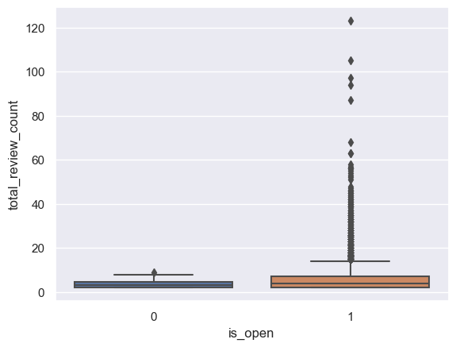
From the Box Plot, we can see that Open businesses generally have higher number of reviews than closed businesses.

## Question 2 Verdict
There is a relation between total number of reviews and whether a business is open: Open businesses have more reviews than closed businesses.


### Term Frequency Analysis
Before we can analyse the common terms used by customers, the nature of text data requires us to perform data cleaning.

### Get Rid of Stopwords, Punctuations, and Lowercase Conversion
The function below uses a regular expression to only keep letters and characters. \
Because we are going to count the frequency of terms, we want to count words like "hello" and "Hello" as the same, regardless of their capitalisation. Hence we each review to lowercase. \
As we want the frequency count to pick up on useful terms, we want to eliminate stopwords like "the", "so", etc. We used a stopword list from `nltk` to filter the stopwords out.

```python
def clean(review):
    
    review = review.lower()
    review = re.sub('[^a-z A-Z 0-9-]+', '', review)
    review = " ".join([word for word in review.split() if word not in stop_words])
    
    return review
```
```python
closed_reviews_text = closed_reviews_text.apply(clean)
closed_reviews_text = closed_reviews_text.to_frame()

open_reviews_text = open_reviews_text.apply(clean)
open_reviews_text = open_reviews_text.to_frame()
```

### Lemmatisation
Before we count the term frequency, we want to make sure we count words like "eat", "eaten" and "eating" as the same word (since they all stem from the same base word "eat").\
To achieve this, we used `WordNetLemmatizer()` built into `nltk`, which provides a list of words that are known to be stemmed from base words. The function is shown below:
```python
lemmatizer = WordNetLemmatizer()
def lemmatize_text(text):
    tokens = word_tokenize(text)
    lemmatized_tokens = [lemmatizer.lemmatize(token) for token in tokens if token not in stop_words]
    return " ".join(lemmatized_tokens)
```

After cleaning the reviews data, the reviews look like this:
```
0          leave hungry fault 8 u left happy leftover good
1        able provide good sandwich panini burger group...
2        able tasty po boy alligator fish service bar f...
3        shopping area decided try yats something diffe...
4        food horrible hot sour soup flavor egg roll so...
                               ...                        
99962    sadie colton amazing colton greeted u sat u so...
99963    hub heard constant advertisement kmox radio sa...
99964    love place super close house everyone bartende...
99965    location never opened website say store open 1...
99966    croissant dont french toast hash brown wildwha...
Name: text, Length: 99600, dtype: object
```
Moving onto the actual Term Frequency Analysis, we will analyse them in trigrams (group of 3 words) to get some context behind individual words. The `trigrams()` function was provided by `nltk` and our function to count the frequencies is defined as follows:
```python
def count_freq(text):
    tokens = word_tokenize(text)
    tokens = trigrams(tokens)
    return Counter(tokens)

```

After getting the frequencies of the trigrams, we plotted the following wordclouds for qualitative analysis:
The trigrams are joined with an underscore (_) to make it clear which words belong to which phrases (as the wordcloud might get messy)

Wordcloud for Closed Businesses:
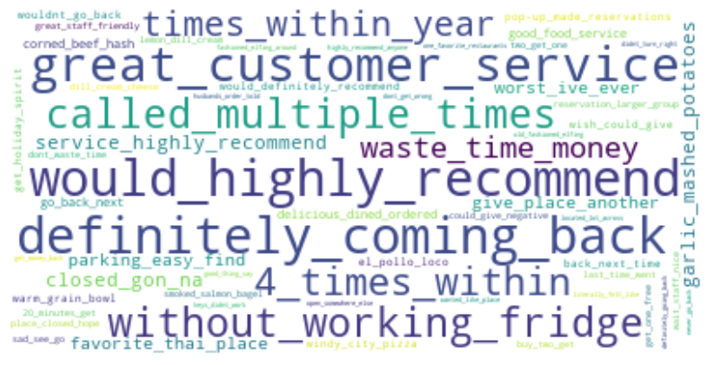

Wordcloud for Open Businesses:
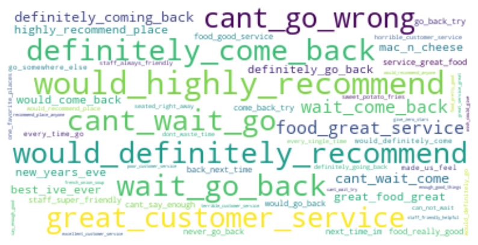

To interpret the wordcloud: larger trigrams appear more frequently than smaller ones \
We realise there are some overlap in what people say about closed vs open businesses such as "would_highly_recommend", "definitely_coming_back".\
However for the closed businessses, there are some negative trigrams such as "waste_time_money", "worst_ive_ever", "without_working_fridge".

From the wordclouds, we can see that the lemmatiser provided by `nltk` was not very effective, as there were phrases like "definitely_coming_back" and "definitely_come_back", showing that "coming" was not lemmatised to "come".

## Question 3 Verdict
Open and Closed businesses have many positive reviews coming up as their frequent trigrams. However, the Closed businesses do have some negative reviews that seem to be significant in size (in the wordcloud).

The reviews for open businesses focused on the good food and customer service. Similarly, the reviews for closed businesses mentioned the businesses' good customer service.

However, the negative reviews for the closed businesses commented that the business was a waste of time and money and how the places did not have a working fridge.

Since food was mentioned as a common word, it seems many of these businesses are food establishments. This claim will be further explored in the later sections.

## Question 4 Verdict

Each business has several categories tagged and we needed a way to generalise the categories as there are `1312` number of unique categories and it is too complicated to analyze every single one.

Thus we decided to do a word count to see spot for potential main category names for each business. However, you can see in the word cloud that there are a number of category names that are related to food and you won't be able to see much common signs of other category names. 


We can hypothersize that majority of the business in the dataset are related to `Restaurants` and `Food` and we needed another way to extract out the main categories for each business. 

We decided to check up on the yelp dataset category list online to see if there are any generalize main categories. [Yelp Dataset Categories](https://blog.yelp.com/businesses/yelp_category_list/). Surely enough they did seperate the business categories into  `main categories` and each of them had `sub categories`. Therefore we decided to use the `main categories` provided in the site for our generalization.

------------------
### Business Category Explanation

`Restaurants` is categorized to businesses where you can sit down and have a meal, typically with table service or a counter where you can order your foods.

`Food` is categorized as businesses that sell food items, but not necessarily in a sit-down dining format.

------------------

We first analyze the count for each main categories. We can clearly see that `Restaurants` has the highest number of business open of a count of `53886` and followed by `Food` with a count of `3444` business open. Next we can see that `Mass Media`, `Religious Organizations` and `Others` category has the lowest number of business open of less than `300`. We can clearly see which business is the most popular and which business is the least popular.

Main category count: 
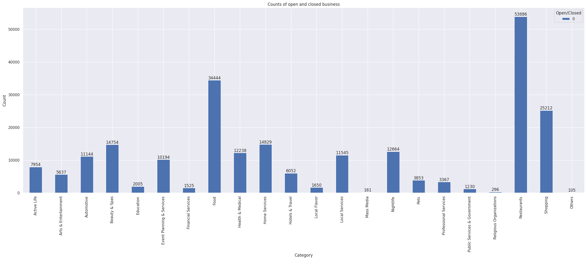

Next we take a look on how many business is still open or closed based on each main category. We can clearly see that `Restaurants` has the highest open and closed business of `36014` and `17872` respectively, followed by `Food` with `25712` open business and `8732` closed business. This can be explained as with higher number of business open, there will be a higher number of business closed due to proportion. 

Main category count (seperated into open/closed):
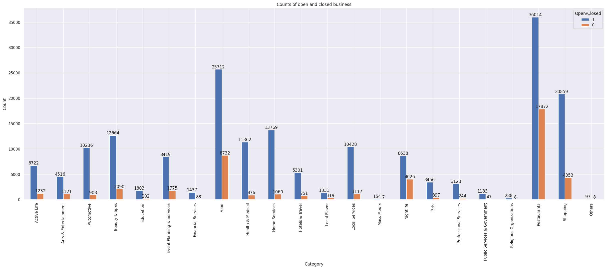

So to examine the proportion of each category, since the range of number of business for each categories is very wide, we shall look at the proportion ratio of the number of `open business` against `total business` for each category.

Main category ratio (percentage of open business per category):
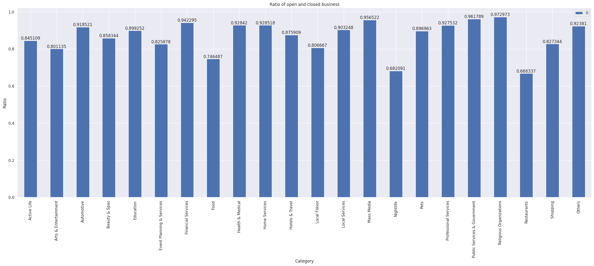

We can observe that `Religious Organizations`, `Public Services & Government`, and `Mass Media` has the higher ratio of more than `0.95`. `Food`, `Nightlife`, and `Restaurants` has the lower ratio of less than `0.75`. This can be explain as with higher number of business based on that category, there will be a higher chance of the business closing as well with the possibility of higher competition among each business.

## Question 5 Verdict
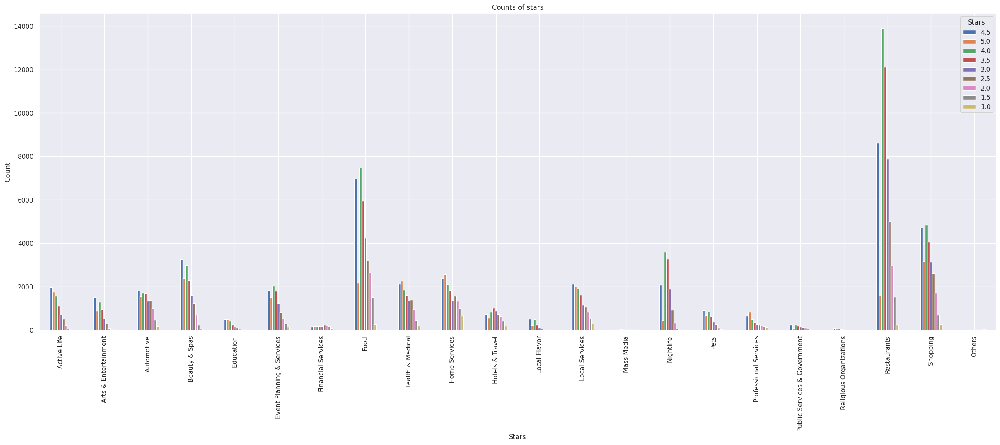

Based on the bar plot, we can see that the number of stars rating is proportion to the number of business open. We can see that `Restaurants` with the highest number of business open has the highest number of stars rating as well. Similarly, the next 2 highest number of business open is `Food` and `Shopping` respectively and their count of stars rating is the next 2 highest as well. Similarly, `Mass Media`, `Religious Organizations` and `Others` has the lowest number of business, so they have the lowest number of stars rating. Overall we can generally see that most of the stars rating are rated between `3.5` - `4.5`.

## Question 6 Verdict
Based on the bar plot of the count of business per state, we can see that `PA` has the highest number of businesses, with a total number of `34039`, followed by `FL` with a total number of `26330` businesses.

However we can also see that there are several states that has less than 5 businesses. `CO`, `HI`, `MA`, `MI`, `MT`, `NC`, `SD`, `TX`, `UT`, `VI`, `VT`, `WA`, `XMS`. 

Number of business per state:
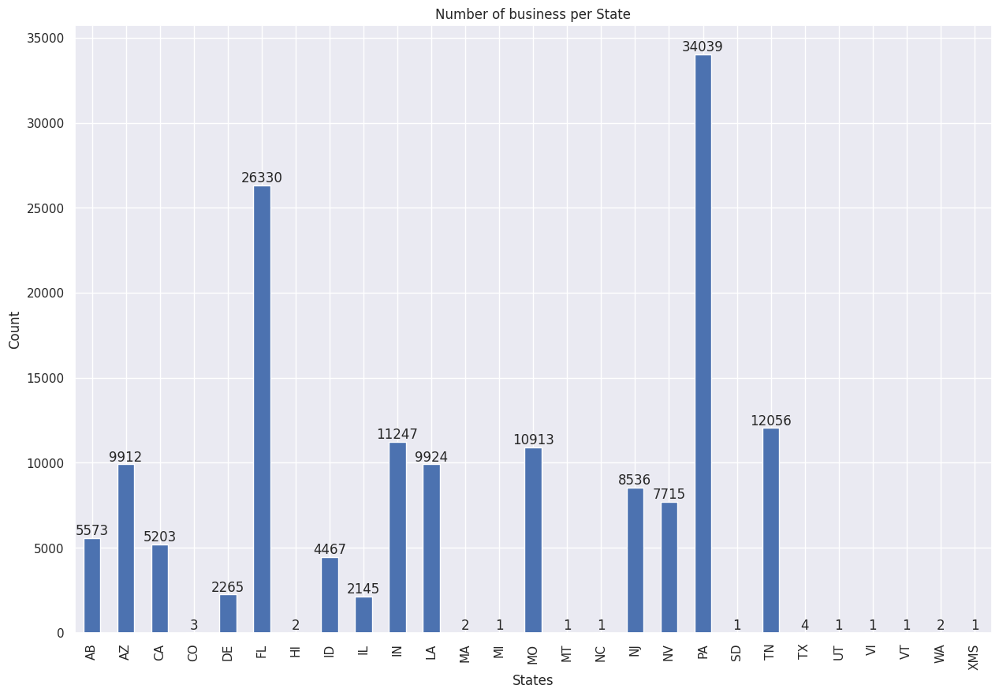

The yelp dataset may not have cover the businesses at those states mention above, thus explaining the low business level. Furthermore, the yelp dataset does not cover every states as there are a total of 50 states in the United States but there is clearly less than 50 based on the graph.

Next we see if there is any patterns based on the number of open and closed business in each states. We can clearly see for those states with higher number of business in total, they have the higher amount of closed business as well. Similarly, for those states with low number of business, there are low number of closed business as well.

Number of business per state (separated into open/closed):
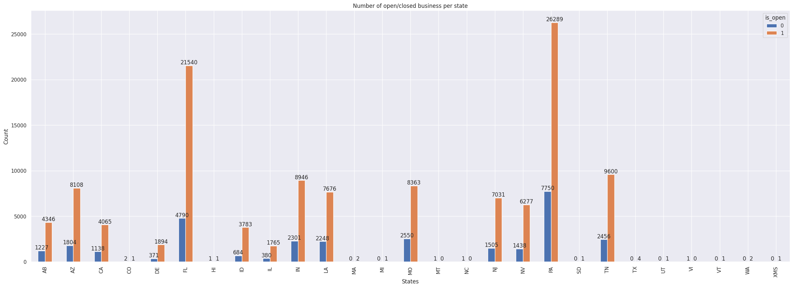

Thus overall, based on this dataset, we can say that `PA` and `FL` states are high consideration location for business owner to open up their business at. However, it is to note that it isn't the most accurate since there are states missing from the dataset and there are extremely low values for several dataset.

## Machine Learning
### Problem & ML Algorithms
Predicting whether a Yelp business will open or close is a Binary Classification problem:
- `0` This business has **closed**
- `1` This business is still **open**.

Machine Learning ML algorithms selected for this data science task are therefore: Logistic Regression, Random Forest & eXtreme Gradient Boosting (XGBoost).

### Class Imbalance
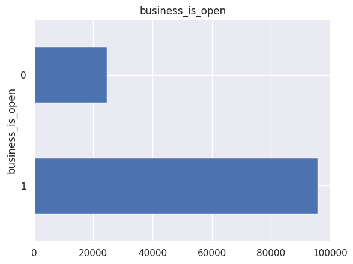
Observing distribution of our target variable `business_is_open`, we can see a imbalance in of open (1) and closed (0) businesses. This imbalance is undesirable as it may cause the model to over bias towards the over represented class. Additionally class imbalance causes evaluation metrics, especially accuracy to become unreliable in determining actual model performance.
 
To combat imbalance, random under sampling of the majority class is done to balance out the no. of examples between classes. Additionally F1 score, the harmonic mean between precision and recall is selected as the replacement metric to evaluate candidate models due to its robustness to class imbalance.

### Feature Engineering
One hot encoding is applied to categorical features to convert such features into numerical representation understood by ML models. Z score normalisation is applied to numeric features to ensure features are invariant to the model.

Additional feature engineering performed by feature
- `business_stars` In Exploratory Data Analysis (EDA), we observed that `business_stars` is right skewed, hence `np.exp2()` is applied to correct the skew.
- `business_categories`
    - EDA shows that `business_categories` is especially high cardinality, making it unsuitable for direct one hot encoding due to the exceeding large no. of columns.
    - High cardinality is a result of `business_categories` being multiple category labels being concatenated together.
    - We extract the _main categories_ [^3] for each set of categories labels to lower cardinality to a manageable level (22 main categories).
    

### Model Selection
Logistic Regression, Random Forest & XGBoost models are trained on training data and evaluated with stratified K Fold cross validation (K=5) to benchmark their relative performance on the dataset.

```
model_class
<class 'sklearn.linear_model._logistic.LogisticRegression'>    0.797952
<class 'sklearn.ensemble._forest.RandomForestClassifier'>      0.811071
<class 'xgboost.sklearn.XGBClassifier'>
```

Based on F1 score tabulated above, XGBoost is selected as the ML Algorithm as it achieves the highest F1 score.

### Hyperparameter Tuning
60 random samples of the following XGBoost Hyperparameters [^4][^5] where evaluated on 80-20 train-validation split to find the optimal combination of Hyperparameters:
- `reg_alpha` (0 - 1000) L1 regularisation applied to model weights.
- `min_child_weight` (0 - 120) Minimum weight of tree node, below which the XGBoost tree will not partition.
- `subsample` (0.5 - 1) Below 1, XGBoost will randomly select a subset of the training data to train on.
- `learning_rate` (0.1 - 0.5) Learning rate of each tree trained at the end of each boosting step.
- `n_estimators` (1 - 4000) No. of rounds of boosting to perform.

Successive Halving is applied to quickly try out hyperparameter combinations on a sample of the training data, eliminating unpromising combinations early tornonament style. This reserves more computational resources to
exploring promising hyperparameter combinations, identified initial trails, in later trials with more data,  which are more computationally expensive.

In particular, `reg_alpha`, `min_child_weight` , `subsample`, `learning_rate` are explored on a logarithmic scale to cover various orders of magnitude for these Hyperparameters.

### Hold Out Test Set
Prior evaluations of model have been performed on validation sets sampled from the training data. This information has been used to tune Hyperparameters, which could have resulted in a overfit of Hyperparameters to training data.

A final evaluation of the best model's performance is performed on the a yet unseen test set to give a unbiased estimate of model performance and check for Hyperparameter overfitting.


## Insights & Recommendation
### Feature Importance
Feature Importance values can be extracted from the XGBoost model ranking how _valuable_ each feature is to the model in making its prediction:

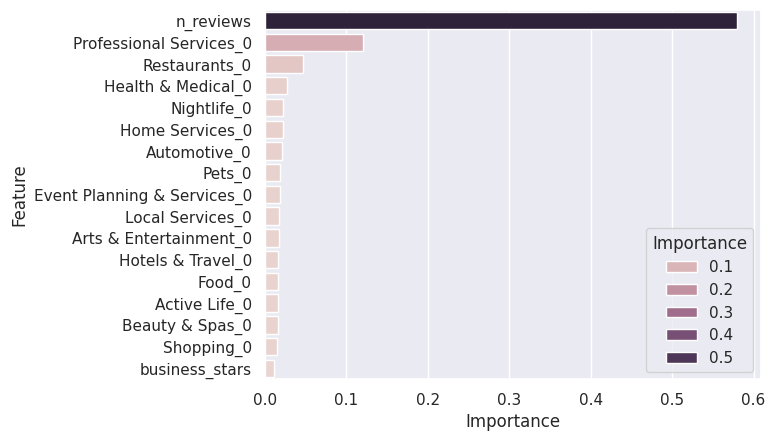

Observing the Feature Importance above, we conclude that the No. of reviews a business receives is the Key Predictor of a Yelp Business's ability to surivive.

### Recommendation
We recommend that Yelp business create incentives for users to post reviews on Yelp as the No. of reviews it receives is the key indicator of the longevity of the business. For example, a free desert could be given to customer upon completion of a Yelp review of the business to incentivise review submission.

**References**

[^1]: https://www.yelp.com/dataset/documentation/main
[^2]: https://parquet.apache.org/docs/file-format/data-pages/encodings/
[^3]: https://blog.yelp.com/businesses/yelp_category_list/
[^4]: https://docs.aws.amazon.com/sagemaker/latest/dg/xgboost-tuning.html
[^5]: https://xgboost.readthedocs.io/en/stable/parameter.html
