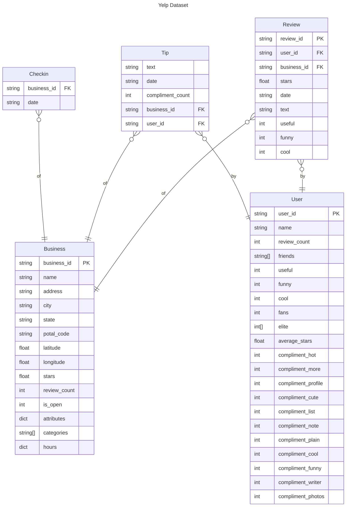

# ntu-sc1015
NTU SC1015 Data Science Project

## Data Preparation
### Dataset Introduction
The Yelp dataset is a subset of user-submitted data on the Yelp online review platform. It contains data about 150,346 businesses, 6,990,280 reviews spanning 11 metropolitan areas in the United States.

The Yelp dataset is primary JSON documents linked by identifiers (eg `business_id`, `user_id` etc.): [^1]



### Sampling & Denormalisation

```
80K     Dataset_User_Agreement.pdf
114M    yelp_academic_dataset_business.json
274M    yelp_academic_dataset_checkin.json
5.0G    yelp_academic_dataset_review.json
173M    yelp_academic_dataset_tip.json
3.2G    yelp_academic_dataset_user.json
```

In its original state, the Yelp dataset is not suitable for analysis as its relatively large. The full dataset cannot be loaded on a single machine. Sampling of the last 100 thousand reviews by review timestamp was performed with Apache Spark to reduce the data to a manageable size suitable for single node processing. Apache Spark scales data processing over multiple nodes and is therefore chosen to handle the large data volume.

Additionally, denationalisation of relationships is performed to form "one wide table" of data for ease of analysis. An outer join is performed on the reviews-business relationship to preserve businesses with no reviews. Due to duplicate nature of denormalised data, the Parquet file format was chosen to store the dataset sample due to ability to better handle duplicates with its run-level / dictionary encoding and snappy compression features [^2].

## Machine Learning
### Problem & ML Algorithms
Predicting whether a Yelp business will open or close is a Binary Classification problem:
- `0` This business has **closed**
- `1` This business is still **open**.

Machine Learning ML algorithms selected for this data science task are therefore: Logistic Regression, Random Forest & eXtreme Gradient Boosting (XGBoost).

### Class Imbalance

Observing distribution of our target variable `business_is_open`, we can see a imbalance in of open (1) and closed (0) businesses. This imbalance is undesirable as it may cause the model to over bias towards the over represented class. Additionally class imbalance causes evaluation metrics, especially accuracy to become unreliable in determining actual model performance.
 
To combat imbalance, random under sampling of the majority class is done to balance out the no. of examples between classes. Additionally F1 score, the harmonic mean between precision and recall is selected as the replacement metric to evaluate candidate models due to its robustness to class imbalance.

### Feature Engineering
One hot encoding is applied to categorical features to convert such features into numerical representation understood by ML models. Z score normalisation is applied to numeric features to ensure features are invariant to the model.

Additional feature engineering performed by feature
- `business_stars` In Exploratory Data Analysis (EDA), we observed that `business_stars` is right skewed, hence `np.exp2()` is applied to correct the skew.
- `business_categories`
    - EDA shows that `business_categories` is especially high cardinality, making it unsuitable for direct one hot encoding due to the exceeding large no. of columns.
    - High cardinality is a result of `business_categories` being multiple category labels being concatenated together.
    - We extract the _main categories_ [^3] for each set of categories labels to lower cardinality to a manageable level (22 main categories).
    

### Model Selection
Logistic Regression, Random Forest & XGBoost models are trained on training data and evaluated with stratified K Fold cross validation (K=5) to benchmark their relative performance on the dataset.

```
model_class
<class 'sklearn.linear_model._logistic.LogisticRegression'>    0.797952
<class 'sklearn.ensemble._forest.RandomForestClassifier'>      0.811071
<class 'xgboost.sklearn.XGBClassifier'>
```

Based on F1 score tabulated above, XGBoost is selected as the ML Algorithm as it achieves the highest F1 score.

### Hyperparameter Tuning
60 random samples of the following XGBoost Hyperparameters [^4][^5] where evaluated on 80-20 train-validation split to find the optimal combination of Hyperparameters:
- `reg_alpha` (0 - 1000) L1 regularisation applied to model weights.
- `min_child_weight` (0 - 120) Minimum weight of tree node, below which the XGBoost tree will not partition.
- `subsample` (0.5 - 1) Below 1, XGBoost will randomly select a subset of the training data to train on.
- `learning_rate` (0.1 - 0.5) Learning rate of each tree trained at the end of each boosting step.
- `n_estimators` (1 - 4000) No. of rounds of boosting to perform.

In particular, `reg_alpha`, `min_child_weight` , `subsample`, `learning_rate` are explored on a logarithmic scale to completely various orders of magnitude for these Hyperparameters.

### Hold Out Test Set
Prior evaluations of model have been performed on validation sets sampled from the training data. This information has been used to tune Hyperparameters, which could have resulted in a overfit of Hyperparameters to training data.

A final evaluation of the best model's performance is performed on the a yet unseen test set to give a unbiased estimate of model performance and check for Hyperparameter overfitting.

**References**

[^1]: https://www.yelp.com/dataset/documentation/main
[^2]: https://parquet.apache.org/docs/file-format/data-pages/encodings/
[^3]: https://blog.yelp.com/businesses/yelp_category_list/
[^4]: https://docs.aws.amazon.com/sagemaker/latest/dg/xgboost-tuning.html
[^5]: https://xgboost.readthedocs.io/en/stable/parameter.html
